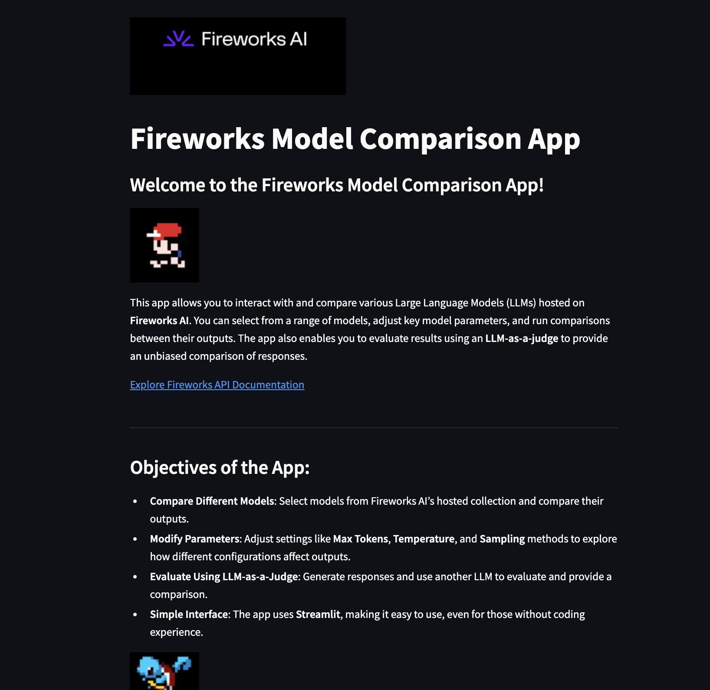
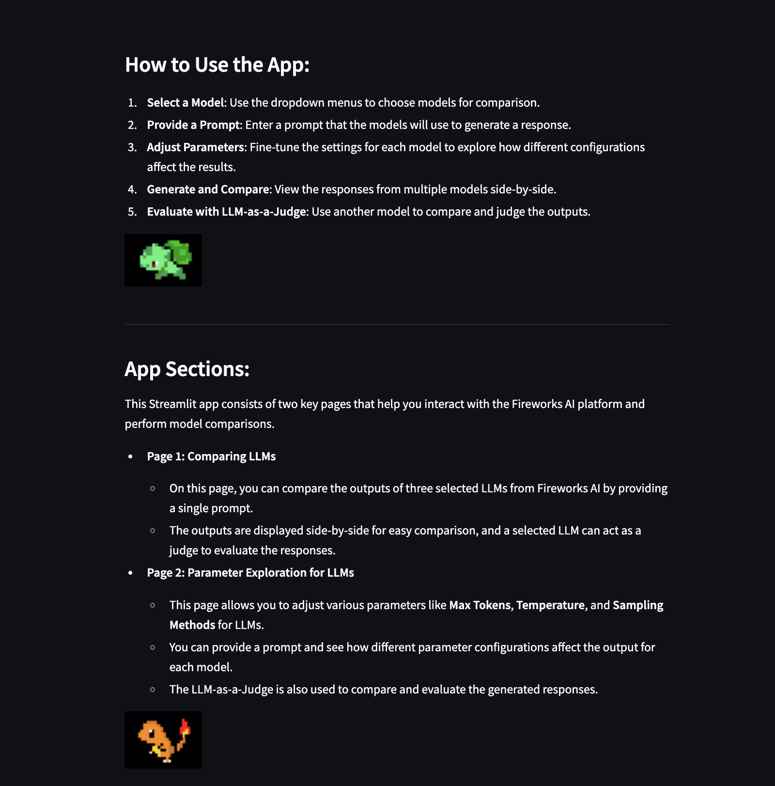
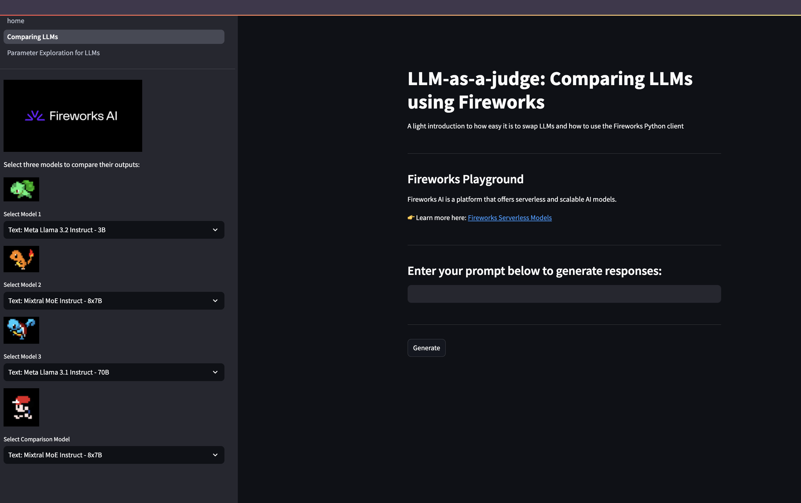
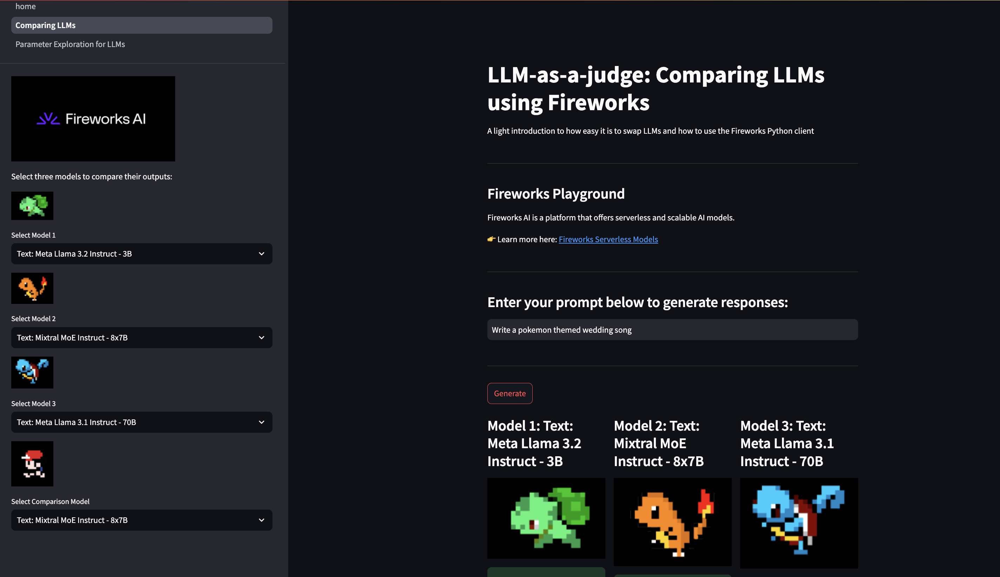
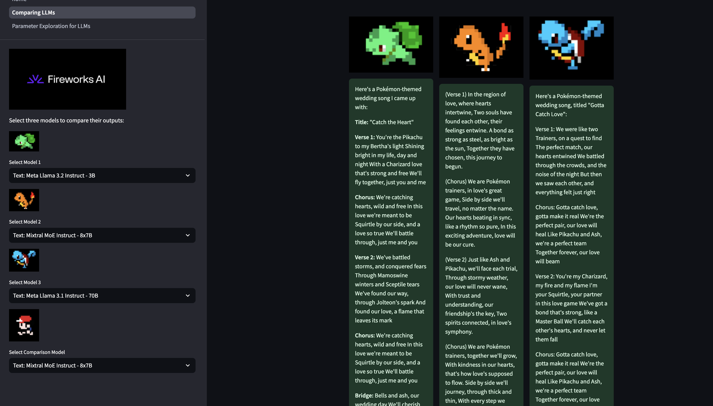
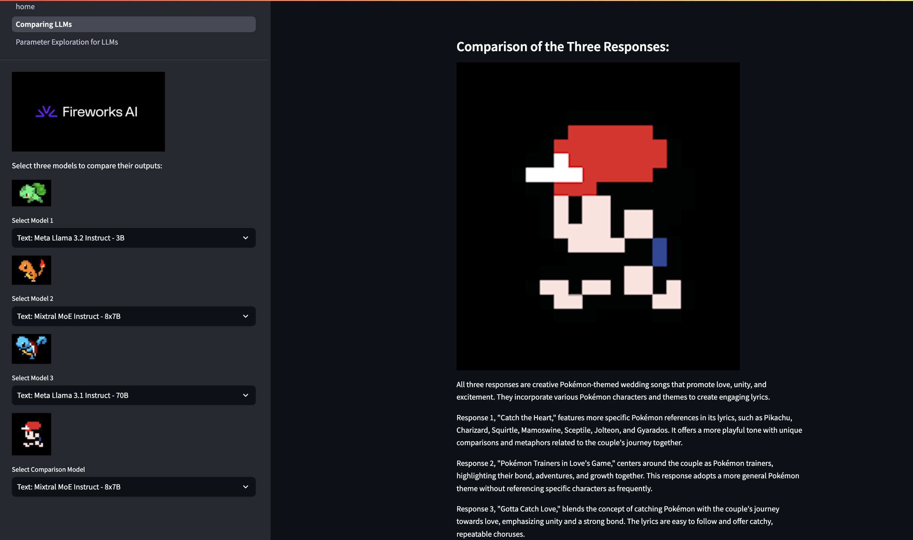
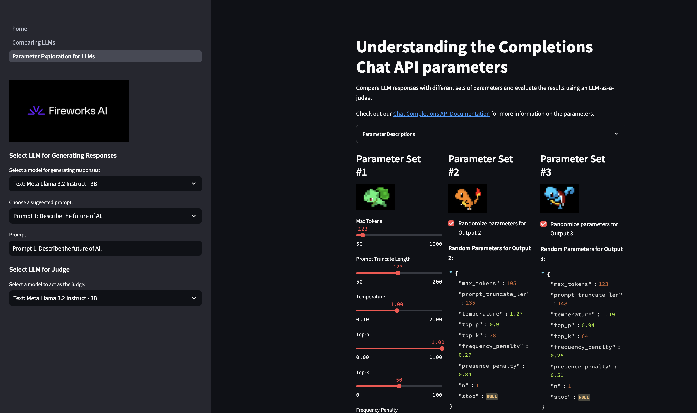
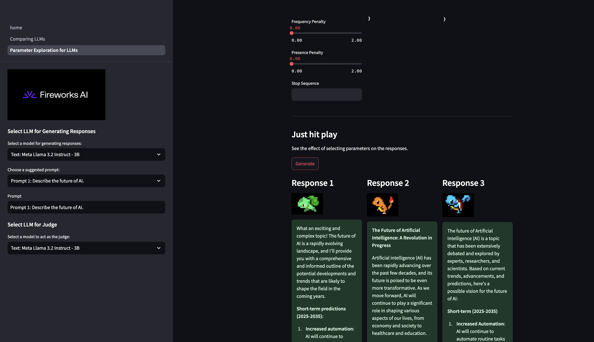
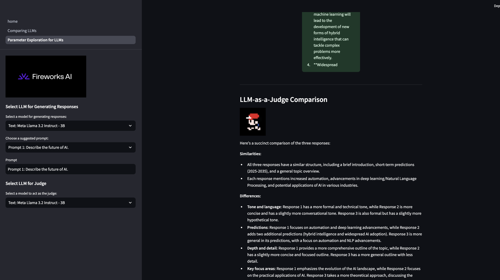
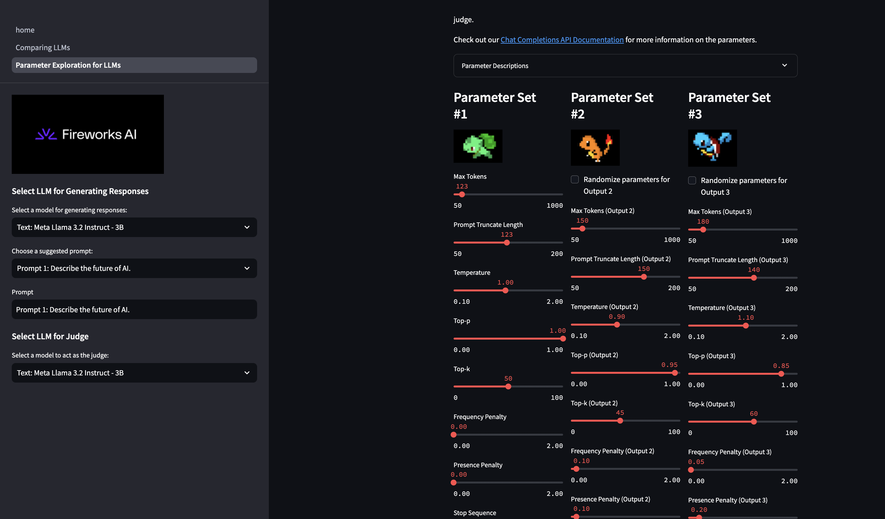

## Project: Fireworks Model Comparison App

### Overview
The **Fireworks Model Comparison App** is an interactive tool built using **Streamlit** that allows users to compare various Large Language Models (LLMs) hosted on **Fireworks AI**. Users can adjust key model parameters, provide custom prompts, and generate model outputs to compare their behavior and responses. Additionally, an LLM-as-a-Judge feature is available to evaluate the generated outputs and provide feedback on their quality.


### Objectives
- **Compare Models**: Select different models from the Fireworks platform and compare their outputs based on a shared prompt.
- **Modify Parameters**: Fine-tune parameters such as **Max Tokens**, **Temperature**, **Top-p**, and **Top-k** to observe how they influence model behavior.
- **Evaluate Using LLM-as-a-Judge**: After generating responses, use a separate model to act as a judge and evaluate the outputs from the selected models.
  





### Features
- **Streamlit UI**: A simple and intuitive interface where users can select models, input prompts, and adjust model parameters.
- **LLM Comparison**: Select up to three different models, run a query with the same prompt, and view side-by-side responses.
- **Parameter Exploration**: Explore and modify different parameters such as Max Tokens, Temperature, Top-p, and more to see how they affect the model's response.
- **LLM-as-a-Judge**: Let another LLM compare the generated responses from the models and provide a comparison.

### App Structure
The app consists of two main pages:
1. **Comparing LLMs**:
   - Compare the outputs of three selected LLMs from Fireworks AI by providing a prompt.
   - View the responses side-by-side for easy comparison.
   - A selected LLM acts as a judge to evaluate the generated responses.







   
2. **Parameter Exploration**:
   - Modify various parameters for the LLMs (e.g., Max Tokens, Temperature, Top-p) and observe how they affect the outputs.
   - Compare three different outputs generated with varying parameter configurations.
   - Use LLM-as-a-Judge to provide a final evaluation of the outputs.






### Setup and Installation

#### Prerequisites
- **Python 3.x** installed on your machine.
- A **Fireworks AI** API key, which you can obtain by signing up at [Fireworks AI](https://fireworks.ai).
- Install **Streamlit** and the **Fireworks Python Client**.

#### Step-by-Step Setup
##### 1. Clone the Repository:
   First, clone the repository from GitHub:

   ```bash
   git clone https://github.com/fw-ai/examples.git
   ```

##### 2. Navigate to the Specific Project Sub-directory:
   After cloning the repository, navigate to the `project_llm-as-a-judge-streamlit-dashboard` sub-directory:

   ```bash
   cd learn/inference/project_llm-as-a-judge-streamlit-dashboard
   ```

##### 3. Set up a Virtual Environment (Optional but Recommended):
   Create and activate a Python virtual environment:

   ```bash
   python3 -m venv venv
   source venv/bin/activate  # On macOS/Linux
   .\venv\Scripts\activate  # On Windows
   ```

##### 4. Install Required Dependencies:
   Install the necessary Python dependencies using `pip3`:

   ```bash
   pip3 install -r requirements.txt
   ```

##### 5. Configure the `.env` File:
   Copy the `.env.template` file and rename it to `.env` in the same project directory:

   ```bash
   mkdir env/
   cp .env.template env/.env
   ```

   Open the `.env` file and add your **FIREWORKS_API_KEY**:

   ```bash
   FIREWORKS_API_KEY=<your_fireworks_api_key>
   ```

##### 6. Run the Streamlit App:
   Finally, run the Streamlit app:

   ```bash
   streamlit run home.py
   ```


##### 7. **Explore the app**:
    - Open the app in your browser via the URL provided by Streamlit (typically `http://localhost:8501`).
    - Navigate between the pages to compare models and adjust parameters.

### Example Prompts
Here are some example prompts you can try in the app:
- **Prompt 1**: "Describe the future of AI in 500 words."
- **Prompt 2**: "Write a short story about a time traveler who visits ancient Rome."
- **Prompt 3**: "Explain quantum computing in simple terms."
- **Prompt 4**: "Generate a recipe for a healthy vegan dinner."

### Fireworks API Documentation
To learn more about how to query models and interact with the Fireworks API, visit the [Fireworks API Documentation](https://docs.fireworks.ai/api-reference/post-chatcompletions).

### Contributing
We welcome contributions to improve this app! To contribute, fork the repository, make your changes, and submit a pull request.

### License
This project is licensed under the MIT License.