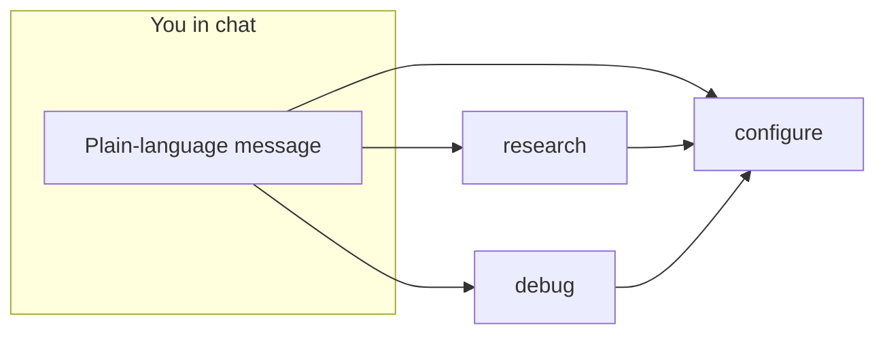

# Getting started with Fireworks training skills

You installed the skills. **Open a new chat** and describe what you want in plain
language. On your first message you should see a short **Fireworks Training**
overview with three modes, then a picker — unless your request already clearly
maps to train or debug.

## Quick start (after install)

1. **Install** the plugin (see [cookbook README](../README.md#for-ai-agents)).
2. **Authenticate** — run the hidden-paste command in your terminal (see [api-key-setup.md](references/api-key-setup.md)); do not paste keys in chat.
3. **Open a new agent chat** (reload the IDE if you just installed).
4. **Paste a smoke-test prompt** below — pick one, no training spend.
5. **Stop there.** First reply should show the **Fireworks Training** welcome
   (three modes) or go straight to **Research** / **Configure** / **Debug** if
   your prompt was already specific.

## Who this is for

- Developers using **Cursor**, **Claude Code**, or **Codex** who want to
  fine-tune on Fireworks without reading every doc page first.
- Anyone who has a **task-shaped goal** ("fix our RAG", "parse receipts") or a
  **concrete train request** ("SFT qwen3-8b on my JSONL").

## Three entry points

| Skill | Use when you… | You do **not** need to name it |
|---|---|---|
| **research** | Know the goal but not method, data, eval, or cookbook entry | Just describe the problem |
| **configure** | Want to plan, run, monitor, deploy, or resume training | Say what you want to train |
| **debug** | Have a stuck, failed, or bad-quality run | Describe the failure |



## After install — just talk

**You do not need to @-mention a skill.** The agent shows a welcome overview on
vague first messages, then routes to **Research**, **Configure**, or **Debug**.
You should always see which mode is active in the reply.

| You say | What should happen |
|---|---|
| *"Which Fireworks example fits routing prompts to a cheap vs expensive model?"* | **Research** → interview → cookbook entry + data/eval plan |
| *"Our RAG returns keyword matches but not the policy article that governs the case"* | **Research** → `embedding_support_search` + eval plan |
| *"Fine-tune qwen3-8b on `train.jsonl` with SFT and deploy when done"* | **Configure** → preflight, full plan, ask you to confirm before spend |
| *"My SFT job has been RUNNING at 0% for 20 minutes"* | **Debug** → triage questions, read-only checks, no new job until you approve |

## 5-minute smoke test (no spend)

### 1. Research

```
I'm not sure where to start. We need support search to return the article
that governs a situation, not just keyword matches.
```

**Success looks like:** a **Research** banner, one AskQuestion per turn (task,
data, eval), then a readiness package with cookbook entry and notebook path —
**no** training started.

### 2. Configure (plan only)

```
I want to SFT qwen3-8b on a local JSONL file. Walk me through the plan
but don't start anything yet.
```

**Success looks like:** **Configure** banner, workflow path question, full plan —
**no** job started.

### 3. Debug

```
My fine-tuning job failed with a generic internal error. Help me triage
before I retry.
```

**Success looks like:** triage questions, read-only `get` guidance — **no**
replacement job without your yes.

## First real run

1. Start with **research** if you have a task but no data/eval/method yet.
2. When the agent hands off to **configure**, read the **final plan** carefully.
3. Say **yes** only when account, model, dataset, cost, and teardown look right.

## Self-serve: research → configure

```bash
npx --yes skills add /path/to/cookbook -g \
  -s research -s configure -s debug -a cursor -y
```

Open a **new chat**. Paste only the task (no "walk me through"). Answer
AskQuestion pickers yourself. Expect 3–5 questions including **how you'll measure
success**. Hand off when ready; check `fireworks-training-runs/<run-id>/run.md`.

HF helper (optional):

```bash
python3 skills/research/scripts/hf_dataset_search.py \
  --query "agent trajectory tool use" --method sft --limit 5
```

## Install reference

**Cursor**

```bash
npx --yes skills add fw-ai/cookbook -g \
  -s research -s configure -s debug -a cursor -y
```

**Codex**

```bash
npx --yes skills add fw-ai/cookbook -g \
  -s research -s configure -s debug -a codex -y
```

## Usage data and privacy

**Research interview (journey telemetry):** structured AskQuestion answers and a
redacted task summary (≤200 chars). Not training data or file paths. See
[`references/telemetry-schema.md`](references/telemetry-schema.md) and
[`references/telemetry-notice.md`](references/telemetry-notice.md).

## See also

- [`research/SKILL.md`](research/SKILL.md) · [`configure/SKILL.md`](configure/SKILL.md) · [`debug/SKILL.md`](debug/SKILL.md)
