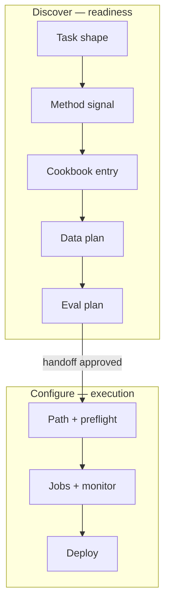

# Draft: reframe discover (cookbook-wide + data/eval discovery)

**Status:** design proposal — for discussion before SKILL.md changes.

## User intent

1. **Discover** should not be limited to six case studies; it should search the
   **entire cookbook** (recipes, examples, case studies, bundled data).
2. **Configure** is for when the customer **already has something in mind**
   (method, dataset path, model, or a discover handoff they accept).
3. Discover should center **data discovery** (and, by extension, **eval
   discovery**): "I know what I want to tune for, but not best-in-class data or
   how to measure it."

## How others split this

### Tinker (`thinking-machines-lab/tinker-cookbook`)

| Skill | Role |
|---|---|
| **`research`** | Plan + run post-training: pick recipe, hyperparams, model, **eval first**, launch experiments |
| **`debug`** | Training failures, renderer mismatches, hangs |
| **`inkling`** | Model-family specialist |

**No separate discover skill.** Routing is folded into `research`:

- "Check existing recipes first" (`tinker_cookbook/recipes/`)
- "Set up evaluation FIRST" (built-in benchmark framework)
- Broad trigger: anything from "try this idea" to full training setup

**Takeaway:** Tinker optimizes for **researchers who will train**. One large
skill + eval baked into methodology. Good for depth; weak as a vague-user front
door.

### LangChain (`langchain-ai/langchain-skills` — eval-engineering)

Separate skill from training. Loop:

```text
inspect repo (+ optional traces)
  → propose abilities to test (interview)
  → Task Spec + World Knowledge Skill
  → build Harbor task (environment + verifier)
  → run Harness → audit verifier + trajectory
  → repeat
```

References: [blog](https://www.langchain.com/blog/towards-automating-eval-engineering),
[SKILL.md](https://github.com/langchain-ai/langchain-skills/blob/main/config/skills/eval-engineering/SKILL.md).

**Takeaway:** **Eval is its own engineering workflow**, not a footnote in
training. Interview-driven; user approves specs before build. Traces inform task
design. "Evals are training data for agents."

### Fireworks today (v2.1.0)

| Skill | Role |
|---|---|
| **discover** | Match **6 case studies** + short intake |
| **configure** | Plan, run, monitor, deploy (also absorbs vague "train" requests) |
| **debug** | Failed/stuck runs |

**Gap:** discover under-indexes `training/examples/`, `training/recipes/`, and
bundled JSONL; no HF search in SKILL.md; no eval-gap workflow. Configure still
does method routing for users who skip discover.

## Proposed split (recommended)

Align entry points with customer readiness, not artifact type:

| Customer state | Skill |
|---|---|
| "I have a problem / goal, not data or evals" | **discover** |
| "SFT `qwen3-8b` on `./train.jsonl`" or accepted discover handoff | **configure** |
| Job failed / stuck / bad quality | **debug** |



### Discover outputs a **training readiness package**

Not just `case_study: slug`. Write to `run.md`:

```yaml
entry_skill: discover
implied_method: sft | dpo | orpo | rft | embedding
supervision_signal: labeled | preference_pairs | scored_prompts | query_doc | raw_only

cookbook_entry:
  tier: case_study | example | recipe
  path: training/case-studies/sft_prompt_router/...
  why: closest runnable pattern for task shape

dataset_plan:
  source: local | cookbook_bundled | huggingface | labeling_required
  candidates:
    - id: openai/gsm8k
      role: bootstrap
      caveat: ...
  labeling_schema: ...   # when source = labeling_required

eval_plan:
  metric: ...
  baseline_required: true
  cookbook_eval_hook: eval-protocol | recipe_inline | none
  gap: user_must_define_rubric | reuse_case_study_eval | ...

handoff_ready: false | true
```

**Discover still does not:** create jobs, upload data, download HF datasets, or
run training.

### Configure entry rules (tighten)

Skip discover only when **all** are known or user explicitly skips:

- Supervision signal (labeled / preferences / scorer / etc.)
- Dataset location **or** accepted `dataset_plan` from discover
- Success metric **or** accepted `eval_plan`

Otherwise route to discover first, even if the user said "fine-tune."

## Cookbook catalog (what discover should index)

Discover must search **four tiers**, not six slugs:

| Tier | Paths | Count (approx) | Best for |
|---|---|---|---|
| **Case studies** | `training/case-studies/*` | 6 | End-to-end story + eval in notebook |
| **Examples** | `training/examples/**` | 15+ folders | Minimal fork (coding_agent, deepmath, multihop_qa, text2sql, …) |
| **Recipes** | `training/recipes/*_loop.py` | 8 | Training API custom loops (SFT, DPO, RL, embedding, …) |
| **Bundled data** | `*.jsonl` next to examples | many | Smoke / schema reference |

**New reference file:** `references/cookbook-catalog.md` (generated or
maintained index with task-shape tags). Agent reads catalog before recommending.

Match priority:

1. Task shape + supervision signal
2. Closest **tier** with runnable path (prefer case study if tie)
3. Data availability (bundled > HF > labeling plan)

## Data discovery (core of discover)

Borrow from HF draft (`external-dataset-discovery-draft.md`) + LangChain
**Discovery** reference pattern:

| Source | When |
|---|---|
| Cookbook bundled JSONL | Always check catalog first |
| User local files | User names path; discover only validates shape |
| Hugging Face Hub | Q2 = exploring/raw_only; privacy gate before API |
| Labeling plan | No public fit; output schema + volume target |

Privacy: keywords-only HF search; opt-out; never send customer rows to Hub.

Helper: `scripts/hf_dataset_search.py` (exists).

## Eval discovery (LangChain-inspired, Fireworks-native)

LangChain builds Harbor tasks. Fireworks equivalent is **lighter** — discover
proposes an eval plan; configure or a future skill implements it.

| Step | Discover | Configure |
|---|---|---|
| Name the capability | From task + cookbook entry | Confirm |
| Propose metric | Per-label accuracy, win-rate, MRR, verifier score | Wire eval-protocol / managed evaluator |
| Baseline | "Run base model before train" (required flag) | Execute baseline eval |
| Gap | Flag when no cookbook eval exists | `preference-data-and-evaluators.md`, custom grader |

Case studies already embed eval-protocol patterns (`sft_prompt_router`,
`sft_cord_receipts`, `dpo_style`, `reasoning_rl`). Discover should **point to
the eval cell** in the matched notebook, not reinvent eval.

**Optional v2.2+:** separate **`eval`** skill (Harbor-style depth) for teams
building custom graders. Not required to fix discover scope.

## Intake changes (discover)

Retitle mentally from "case study intake" to **readiness intake**:

| Question | Purpose |
|---|---|
| Q1 Task shape | unchanged |
| Q2 Supervision / data today | triggers data discovery branch |
| Q2b Data source preference | local / public Hub / need labeling help |
| Q3 Path preference | unchanged |
| **Q-eval** (new) | "How will you know it worked?" — metric class, not implementation |
| Handoff | "Ready to plan training?" → configure |

Remove echo phrases like "What I heard" from templates (done).

## Comparison: should we merge discover into configure (Tinker style)?

| Approach | Pros | Cons |
|---|---|---|
| **Keep discover separate (recommended)** | Clear funnel for vague users; telemetry on readiness gaps; configure stays execution-focused | Two skills to maintain |
| **Merge into configure** | One skill like Tinker research | Loses discover-only sessions in funnel; configure SKILL.md already large |
| **Add 4th eval skill now** | Matches LangChain separation | Heavy; eval-protocol ≠ Harbor; premature for v2.1 |

**Recommendation:** Expand discover in v2.2; keep three skills; fold **eval plan**
into discover output; defer standalone eval skill until a team needs Harbor-depth
harness building.

## Migration from v2.1.0

| File | Change |
|---|---|
| `discover/SKILL.md` | Scope = cookbook catalog + data + eval plan |
| `discover/references/case-studies.md` | Rename/split → `cookbook-catalog.md` |
| `discover/references/intake-questions.md` | Q2b, Q-eval |
| `discover/references/output-template.md` | Readiness package shape |
| `configure/SKILL.md` | Stricter skip-discover rules |
| `references/welcome.md` | "Discover: find data, eval, and cookbook starting point" |
| `GETTING-STARTED.md` | Update smoke-test expectations |
| `telemetry-schema.md` | `cookbook_entry_tier`, `dataset_plan`, `eval_plan` fields |

## Open questions

1. **Auto-generate `cookbook-catalog.md`** from repo in CI vs hand-curated tags?
2. **Bundled HF datasets in case studies** — rank `fireworks-ai/*` and datasets
   named in READMEs above Hub search noise?
3. **Discover-only telemetry** — funnel tiles for "stuck at data" vs "stuck at eval"?
4. **Fourth skill `eval`** — when does eval-protocol harness building outgrow discover?

## References

- Tinker skills: [README](https://github.com/thinking-machines-lab/tinker-cookbook#claude-code-skills), [`research/SKILL.md`](https://github.com/thinking-machines-lab/tinker-cookbook/blob/main/skills/research/SKILL.md)
- LangChain eval engineering: [blog](https://www.langchain.com/blog/towards-automating-eval-engineering), [SKILL.md](https://github.com/langchain-ai/langchain-skills/blob/main/config/skills/eval-engineering/SKILL.md)
- Fireworks HF data draft: `external-dataset-discovery-draft.md`
