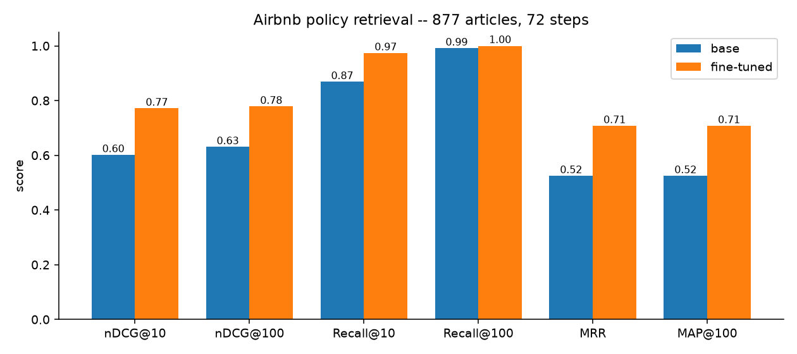

# Embeddings: Teaching a retriever which policy actually applies

In this example we'll fine-tune an embedding model so that when someone describes a messy real situation, search returns the help-center article that *governs* it — not the one that merely sounds like it.

**Is this you?** Your search or RAG returns articles that are topically adjacent but not the one that answers the question. A host asks about a guest smoking indoors when the house rules never mentioned smoking; the governing article is *Safety tips for hosts*, not whichever page says "smoking" most often. Your policy structure isn't in the base model's pretraining, so no amount of prompting gets you there.

**The data.** We'll use `[profoz/airbnb-policy-scenarios](https://huggingface.co/datasets/profoz/airbnb-policy-scenarios)`: 997 real-sounding situations (769 train / 228 test) over 877 Airbnb Help Center articles, each scenario paired with the one article that governs it. It's **text**. The notebook builds it inline and evaluates on the held-out `test` split against the *whole* corpus, so the "after" score is honest.

**The model.** We'll tune `qwen3-embedding-8b` full-parameter — already a strong general retriever, so what we're adding is your domain's notion of relevance, not language understanding.

**The technique.** This is **contrastive fine-tuning** with in-batch negatives: each batch builds a similarity matrix where the diagonal holds the true (situation, article) pairs and every other cell is a negative you got for free. You never supply negatives. It's the right tool when "relevant" means something your domain defines rather than plain semantic similarity.

**What we'll do.** Run `airbnb_policy_embedding.ipynb` top to bottom: build the data, score the base model, fine-tune, re-register and deploy the checkpoint, then score again with the same harness. We report **MRR** — with one correct article per question, that reads as "how far down the list is the right answer." The training and deploy cells spend real GPU time.

**What to expect.** 72 optimizer steps over 769 pairs, scored on the 228 held-out situations against all 877 articles:

MRR goes 0.52 -> 0.71, which moves the correct article from about rank 1.9 to 1.4.