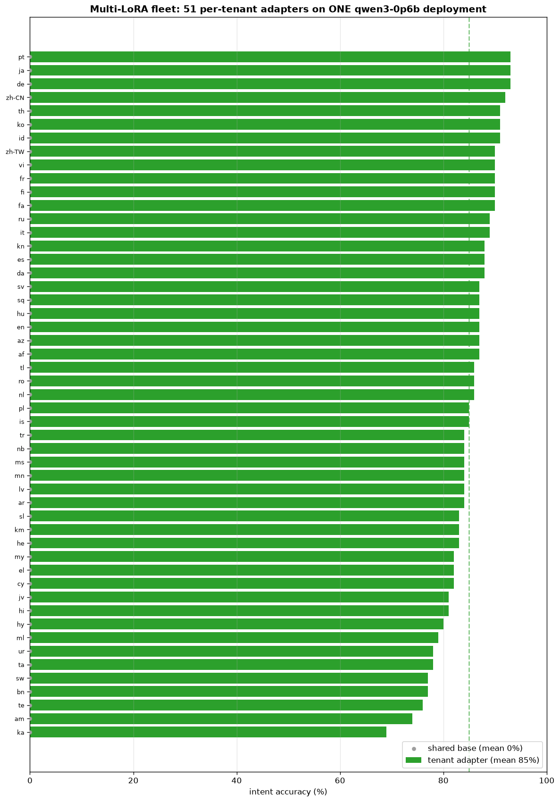
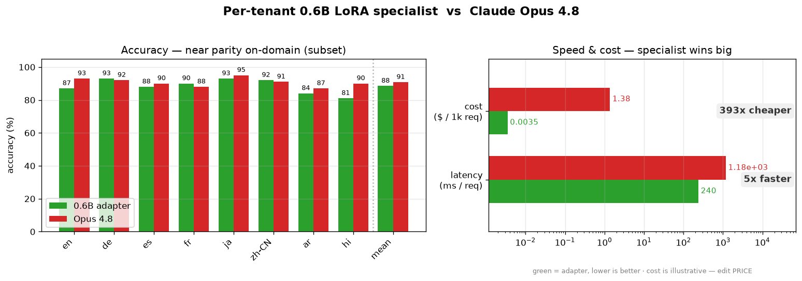

# Multi-LoRA: One deployment, many specialists

In this example we'll train a separate little "adapter" for each customer (here, each language) and then serve *all of them* from a single model deployment — routing each request to the right specialist on the fly.

**Is this you?** You serve lots of tenants, domains, or languages; one shared model does an okay job for everyone but a great job for no one — and running a full dedicated model per tenant would break the budget. This pattern gives each tenant its own behavior without its own GPU bill.

**The data.** We'll use `[AmazonScience/massive](https://huggingface.co/datasets/AmazonScience/massive)` (via the script-free mirror `[mteb/amazon_massive_intent](https://huggingface.co/datasets/mteb/amazon_massive_intent)`), a multilingual "what did the user mean?" (intent) dataset covering **51 locales**. We treat **each locale as its own tenant** and use MASSIVE's three native splits per locale: **train → SFT**, **validation → Fireworks** `evaluation_dataset` (validation loss + early stop), **test → holdout** for before/after eval and the frontier comparison. Row caps (`MAX_TRAIN` / `MAX_VAL` / `MAX_HOLDOUT`) keep 51 jobs affordable; raise them toward the full splits (11,514 / 2,033 / 2,974) for best accuracy.

**The model.** One puny `qwen3-0.6b` base (<=3B, supports LoRA addon serving), plus a small **LoRA adapter per language** stacked on top — **51 adapters on one deployment**.

**The technique.** We fine-tune each adapter with **LoRA SFT** (cheap and fast), then use **multi-LoRA serving**: load every adapter onto one base deployment (with `--enable-addons`) and pick the right one per request. One footprint, many specialists. Keep **min-replica=1** during the eval — an on-demand deployment at 0 replicas returns 404 for inference (it does not cold-start from a request), so eval would score 0% across the board. The teardown cell releases the GPU.

**What we'll do.** Run `multilora_fleet.ipynb` — smoke-test with a couple of locales, then scale to all 51. We compare the shared base vs. each tenant's own adapter across every locale, and finish with a frontier check (adapter vs. Claude Opus 4.8) on a representative subset. The 51 training jobs and the warm deployment cost GPU.

## Results

One `qwen3-0.6b` deployment, one LoRA adapter per locale, intent-classification accuracy on each locale's holdout (`test` split). The bare base scores ~0% because it emits free-form paraphrases instead of the exact intent-label vocabulary; each tenant's adapter learns its label set. The full 51-locale base-vs-adapter overview:

And the frontier check — a per-tenant 0.6B specialist vs. Claude Opus 4.8 on a representative subset (near-parity on-domain, far faster and cheaper):

