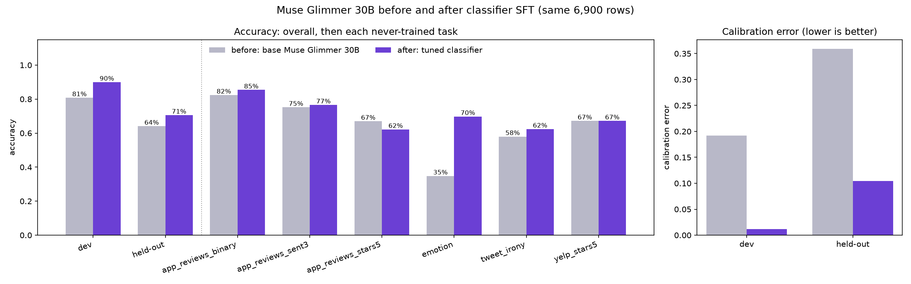
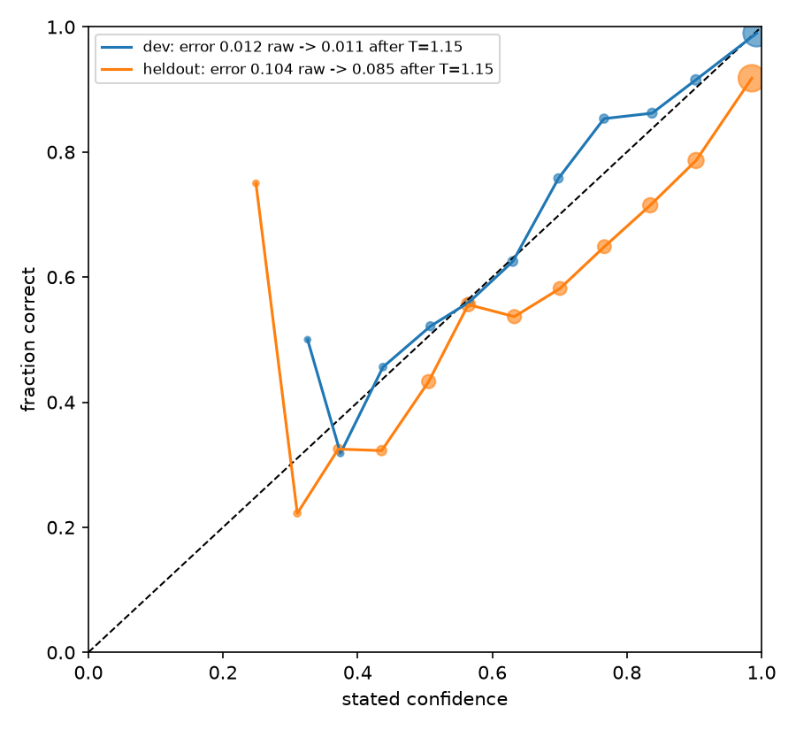

# A calibrated decision classifier on Muse Glimmer 30B

Jev is a popular decision model. You give it a state (a customer message, a review, a tool call), a question,
and a short list of options, and it picks one and tells you how sure it is. People use models like it for ticket
routing, policy checks, moderation, and deciding which tool an agent should call.

This case study trains a model in the same style on Muse Glimmer 30B using only SFT, temperature scaling, and
one simple prompting trick: asking the question twice. The model answers with a single letter, so one request
gives you both the decision and a probability for every option.

`[muse_classifier.ipynb](muse_classifier.ipynb)` trains on `muse-glimmer-30b` with serverless LoRA SFT
(1 epoch, batch 64, rank 64, about 25 minutes) and scores the untrained base and the tuned model on the same
6,900 rows.

## Results

| Slice                                 | Base accuracy | Tuned accuracy | Base calibration error | Tuned calibration error |
| ------------------------------------- | ------------- | -------------- | ---------------------- | ----------------------- |
| Dev (trained tasks, unseen rows)      | 80.8%         | **90.0%**      | 0.192                  | **0.012**               |
| Held-out (six tasks never trained on) | 64.1%         | **70.6%**      | 0.359                  | **0.104**               |

- **Accuracy goes up on both slices:** +9.2 points on trained tasks and +6.5 points on never-trained tasks. Both
gains are well outside noise (95% ranges +8.0 to +10.4 and +5.0 to +8.0 points).
- **Confidence becomes trustworthy.** Calibration error (the gap between stated confidence and how often the model
is right; 0 is perfect) falls about 16x on trained tasks and 3.5x on never-trained ones.
- **Biggest single gain:** emotion labels, 35% to 70%. **One regression:** 5-star app-review ratings, 67% to 62%;
fine-grained star ratings are this recipe's weak spot.
- Zero format misses for either model.

The tuned model is close to calibrated straight out of training, so a dev-fit temperature (T = 1.15) only nudges
held-out calibration error from 0.104 to 0.085. If calibration on your own task matters, fit T on a few labeled
examples from that task.

## Files

| File                    | What it holds                                                               |
| ----------------------- | --------------------------------------------------------------------------- |
| `muse_classifier.ipynb` | the end-to-end run: data, render check, training, evaluation, results       |
| `classifier_harness.py` | prompt format, data build, deployment, scoring, calibration helpers         |
| `classifier_data.py`    | loaders for the public Hugging Face tasks and the four synthetic rule tasks |

Training data is the train split of 35 public classification tasks plus four synthetic rule tasks generated
from templates; no text or label is written by a model. Some sources are research-only or non-commercial, so
check each license before reusing the data in a product.

## Run it

Set `FIREWORKS_API_KEY` and `FIREWORKS_ACCOUNT_ID` in `.env`, install the cookbook's training dependencies, and
run the notebook top to bottom. Evaluation stands up two 1x B300 deployments (about two hours in total) and
deletes each one when its eval finishes.