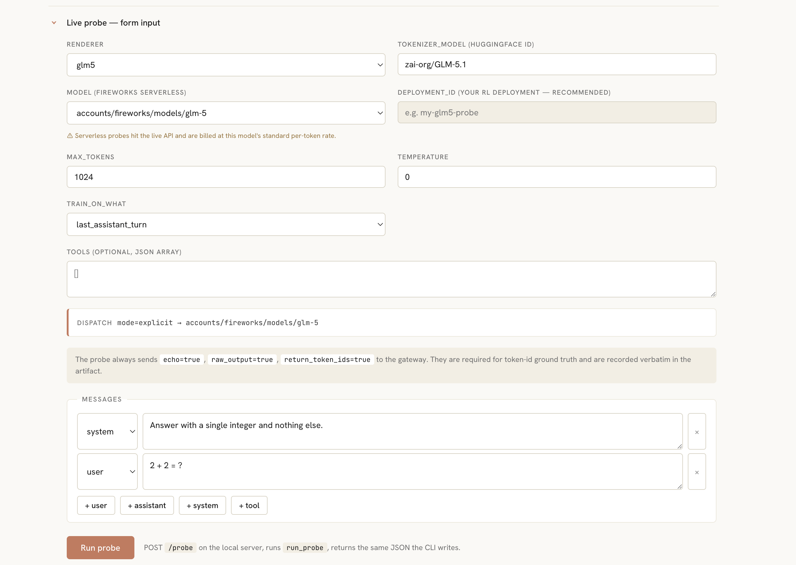
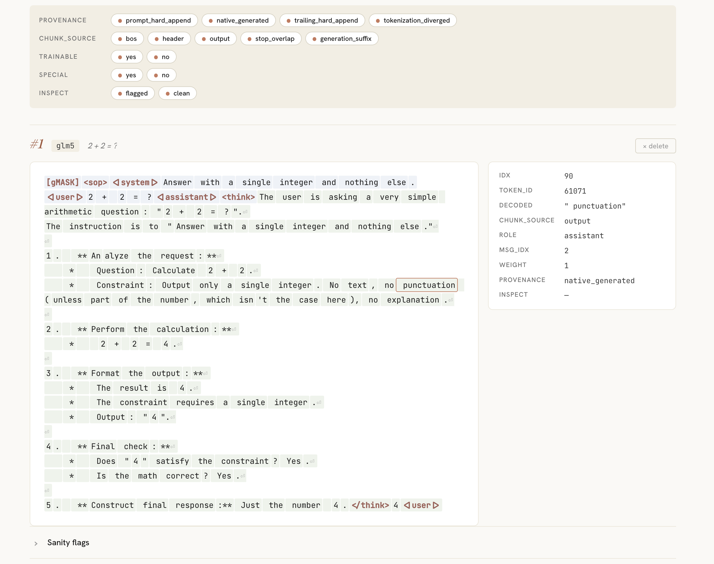

# Renderer verifier

Validates that a cookbook renderer produces the same tokens the live
Fireworks gateway emits, and that loss weights are consistent with
the "hard-append → weight 0, native-generated → weight 1" rule. Ships
a probe CLI, a batch triage runner, a single-file React viewer that
highlights every audit-table row by provenance and inspection-rule
match, and a YAML-driven rule engine.

> **How to use it**: see [`cookbook/skills/verifier/SKILL.md`](../../../skills/verifier/SKILL.md).
>
> **Implementing a new renderer to validate**: see [`cookbook/skills/renderer/SKILL.md`](../../../skills/renderer/SKILL.md).

## Live UI

**Configure** — pick a renderer, the tokenizer auto-fills, then choose
between a serverless `model` (live API, billed per token) or a
`deployment_id` (your own RL deployment — recommended). The two are
mutually exclusive in the form. Type messages, hit `Run probe`:



**Inspect** — every token is colour-coded by provenance; tokens that
match a rule in `inspect_rules.yaml` get an amber ripple. Hover any
token and the sticky right sidebar shows its full audit row
(`token_id`, `decoded`, `chunk_source`, `role`, `weight`,
`provenance`, inspect reasons). Filters at the top apply across every
case in the page:



## Layout

```
training/renderer/verifier/
├── cli.py                python -m training.renderer.verifier render | inspect
├── serve.py              python -m training.renderer.verifier.serve
├── triage.py             python -m training.renderer.verifier.triage
├── spinup_deployment.py  personal-deployment helper
├── utils/                engine modules (probe, inspect_rules, hf_parity, …)
├── rules/                inspect_rules.yaml — single source of truth
├── viewer/               single-file React GUI
└── images/               README screenshots
```
