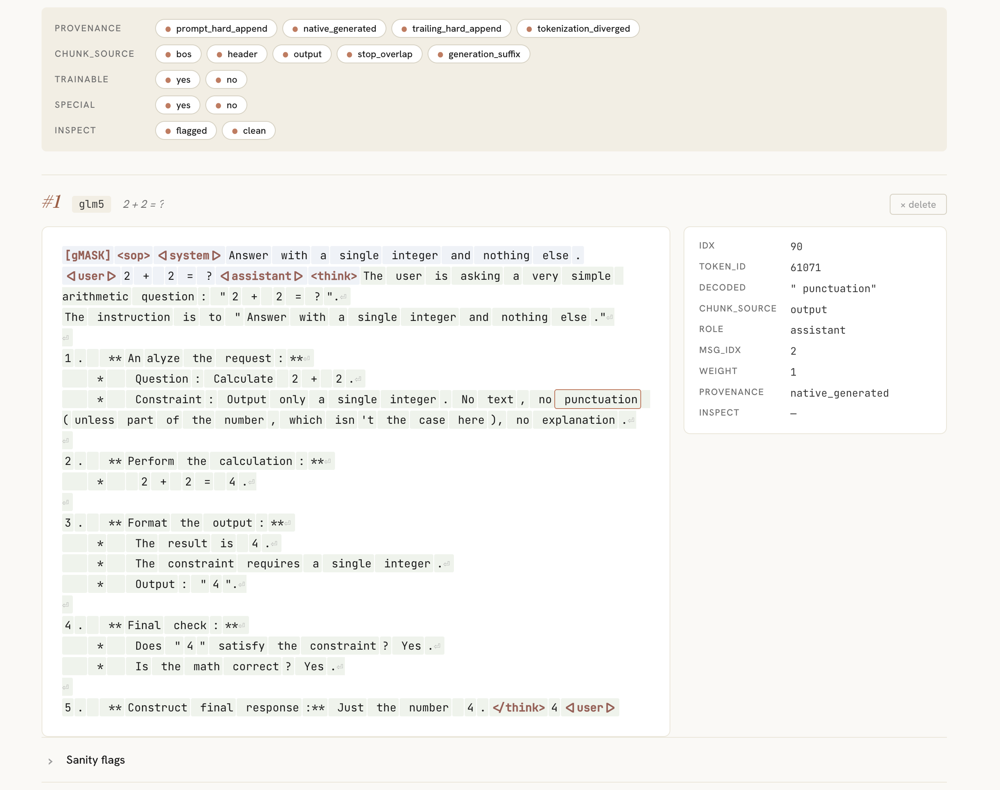

# Renderer verifier

Validates that a cookbook renderer produces the same tokens the live
Fireworks gateway emits, and that loss weights are consistent with
the "hard-append → weight 0, native-generated → weight 1" rule. Ships
a probe CLI, a batch triage runner, a single-file React viewer that
highlights every audit-table row by provenance and inspection-rule
match, and a YAML-driven rule engine.

> **How to use it**: see the canonical training skill's
> [renderer-verification reference](../../../skills/configure/references/renderer-verification.md).
>
> **Implementing a new renderer to validate**: see the
> [renderer implementation reference](../../../skills/configure/references/renderer.md).

## Live UI

**Configure in JSON** — the web UI has no editable probe form and cannot load
saved output artifacts. Start it with one validated input catalog containing
the renderer, tokenizer, optional image processor, deployment, sampling
configuration, messages, tools, and request controls for every case.

**Run sequentially** — review the JSON cases loaded in the page, then click
`Run all sequentially`. The browser clears prior results and calls the
deployment once per case in file order. Each fresh result appears as soon as
that request completes; a failed case does not prevent later cases from
running. Neither the server nor browser loads or caches prior results.

**Inspect** — every resulting token is colour-coded by provenance; tokens that
match a rule in `inspect_rules.yaml` get an amber ripple. Hover any
token and the sticky right sidebar shows its full audit row
(`token_id`, `decoded`, `chunk_source`, `role`, `weight`,
`provenance`, inspect reasons). Filters at the top apply across every
case in the page:

If response parsing is not clean, the result keeps the raw completion and
parse status but omits the supervised round-trip and token audit. This avoids
presenting weights for a structured assistant message the renderer did not
successfully recover.



### JSON input catalog

`--input-file` is required and is the UI's only source of live-run settings and
prompts:

```bash
python -m training.renderer.verifier.serve \
  --input-file /path/to/verifier-input.json
```

The server re-reads and validates this file for every case. The browser sends
only `profile_id` and `example_id`; it cannot submit an edited request or a
saved output. Keep environment-specific deployment IDs and local paths outside
the repository.

```json
{
  "schema_version": 1,
  "profiles": [
    {
      "id": "local-model",
      "label": "Local model checks",
      "defaults": {
        "renderer": "your_renderer",
        "tokenizer_model": "/path/to/tokenizer",
        "image_processor_model": "/path/to/tokenizer",
        "deployment_id": "accounts/your-account/deployments/your-deployment",
        "max_tokens": 256,
        "temperature": 0,
        "train_on_what": "last_assistant_turn"
      },
      "examples": [
        {
          "id": "text",
          "label": "Text",
          "messages": [{"role": "user", "content": "Reply briefly."}]
        }
      ]
    }
  ]
}
```

The catalog rejects unknown fields, output-artifact fields, and
credential-bearing completion arguments. API credentials remain server-side
environment variables and are never part of the input JSON.

### Vision

Set `image_processor_model`, then use OpenAI-compatible `image_url` content
parts in the input JSON. The verifier expands each renderer-produced image
chunk using its `expected_tokens` length and the image-placeholder token ID
declared by the tokenizer (`special_ids.image`, `image_token_id`, or
`image_token`).

## Layout

```
training/renderer/verifier/
├── cli.py                python -m training.renderer.verifier render | inspect
├── serve.py              python -m training.renderer.verifier.serve
├── triage.py             python -m training.renderer.verifier.triage
├── spinup_deployment.py  personal-deployment helper
├── utils/                engine modules (probe, inspect_rules, hf_parity, …)
├── rules/                inspect_rules.yaml — single source of truth
├── viewer/               single-file React GUI
└── images/               README screenshots
```
